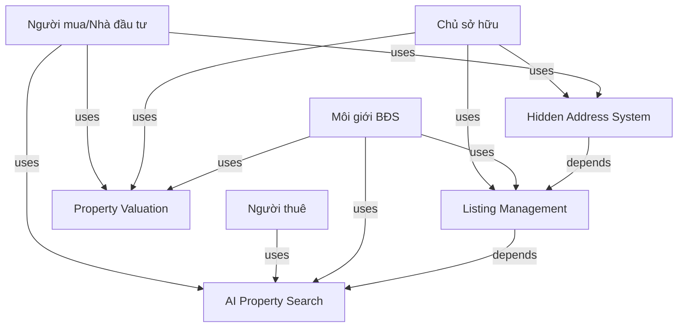

# Software Requirements Specification (SRS)
# Moso.vn

**Document Version:** 1.0  
**Last Updated:** 2026-06-10  
**Author:** SRS Generator Agent (Paige)

---

## 1. EXECUTIVE SUMMARY

### 1.1 Product Overview
MOSO.vn là nền tảng AI Proptech (công nghệ bất động sản ứng dụng trí tuệ nhân tạo) hàng đầu tại Việt Nam. Nó cung cấp các công cụ tìm kiếm nhà đất với dữ liệu thật, quản lý tin đăng miễn phí với tính năng bảo mật "Ẩn số nhà", và định giá tự động bằng AI, giúp quy trình giao dịch bất động sản trở nên minh bạch và an toàn.

### 1.2 Key Objectives
- Cung cấp dữ liệu nhà đất và giá trị thực tế dựa trên AI.
- Bảo vệ quyền riêng tư của chủ sở hữu qua hệ thống Ẩn Số Nhà.
- Rút ngắn thời gian và tối ưu hóa quy trình kết nối người mua và người bán.

---

## 2. USER ANALYSIS

### 2.1 User Personas

| Persona | Role | Goals | Pain Points |
|---------|------|-------|------------|
| Người mua/Nhà đầu tư | Buyer | Tìm nhà theo giá trị thật, tính toán khoản vay | Tin ảo, giá ảo, thiếu thông tin địa chỉ |
| Người thuê | Renter | Tìm nơi ở hoặc mặt bằng kinh doanh | Khó xác nhận thông tin chủ nhà |
| Chủ sở hữu | Owner | Đăng bán/cho thuê hiệu quả, bảo mật | Bị quấy rầy bởi môi giới không uy tín |
| Môi giới BĐS | Broker | Tiếp cận khách hàng, xây dựng thương hiệu | Khó tìm khách hàng nét |

---

## 3. FUNCTIONAL REQUIREMENTS

### 3.1 Feature List

#### Feature 1: AI Property Search
- **ID:** F001
- **Description:** Tìm kiếm bất động sản bằng AI với địa chỉ và giá thật
- **Priority:** High
- **Complexity:** High
- **Dependencies:** None
- **Acceptance Criteria:**
  - [x] Hiển thị chính xác tọa độ trên bản đồ.
  - [x] Lọc bằng natural language.

#### Feature 2: Listing Management
- **ID:** F002
- **Description:** Quản lý tin đăng bất động sản
- **Priority:** High
- **Complexity:** Medium
- **Dependencies:** F001 (AI Property Search)
- **Acceptance Criteria:**
  - [x] Đăng tin miễn phí với form động.

#### Feature 3: Hidden Address System
- **ID:** F003
- **Description:** Hệ thống Ẩn số nhà, chỉ người dùng xác thực mới thấy
- **Priority:** High
- **Complexity:** High
- **Dependencies:** F002 (Listing Management)
- **Acceptance Criteria:**
  - [x] Chỉ tài khoản Verified mới mở khóa được địa chỉ.

#### Feature 4: Property Valuation
- **ID:** F004
- **Description:** Định giá bất động sản bằng AI dựa trên lịch sử giá
- **Priority:** Medium
- **Complexity:** High
- **Dependencies:** None
- **Acceptance Criteria:**
  - [x] Trả về đồ thị biến động giá theo khu vực.

---

## 4. SYSTEM ARCHITECTURE

### 4.1 Knowledge Graph

### 4.2 Entity Relationships
- Property: address, price, area, type, hidden_address
- User: name, role, verified_status
- Relationships: User views Property, Property listedBy User

---

## 5. NON-FUNCTIONAL REQUIREMENTS

- **Performance:** Tìm kiếm phải trả kết quả dưới 200ms.
- **Security:** Mã hóa đầu cuối thông tin "Số nhà" trong Database.
- **Scalability:** Hệ thống Microservices chịu tải hàng triệu người dùng.
- **Maintainability:** CI/CD pipeline tự động.

---

## 6. DEPENDENCIES & ASSUMPTIONS

### 6.1 Feature Dependencies
- Listing Management phụ thuộc vào AI Property Search.
- Hidden Address System phụ thuộc vào Listing Management.

---

## 7. APPENDIX

### A. Knowledge Graph Data
Dữ liệu sinh ra đã lưu trong file `knowledge-graph.json`

### B. Analysis Raw Data
Dữ liệu sinh ra đã lưu trong file `moso-analysis.json`
